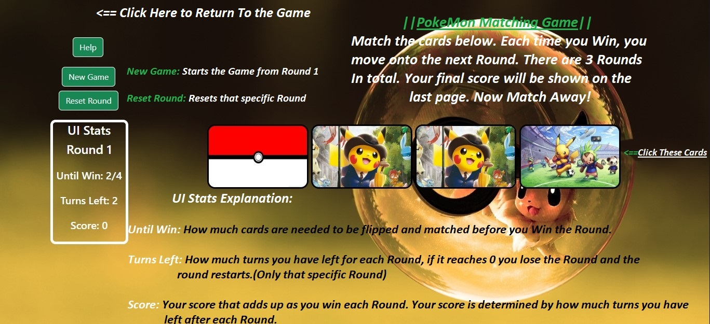
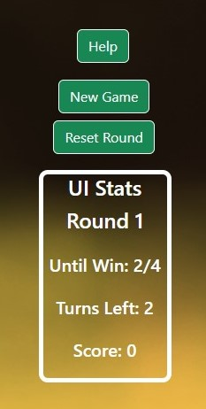

# Pokemon Matching Game
## About this Project :

This README explains more about this game I made using React. Its a simple memory matching game that I made for a project at my coding school, HyperionDev.

## Table of Contents :

* How to Install
* How to Play
* Credits

## How to Install :

Just download the zip file, extract, open the folder with VSCode. Then run **"npm start"** from the terminal/command line.

## How to Play :

### 1 - Rules

The Rules of the game are quite simple. Just click on the cards to flip them around and find matching pairs. Each time you win a Round, you can then move on to the next Round. There is currently 3 Rounds in total. Your final score will be shown on the last page.

### 2 - UI and Stats

Next lets explain the UI and The stat panel.

#### New Game: 
Restarts the whole game from Round 1 Regards of the round you are on. Also resets the score.

#### Reset Round:
Resets the cards of that specific Round only. This includes the stats of that round.

#### Until Win:
How much cards are needed to be flipped and matched before you win the Round.

#### Turns Left:
How much turns you have left for each Round, if it reaches 0 you lose the Round and the round shall restart automatically.
(This is only for that specific round)

#### Score:
Your Score that adds up as you win each Round. Your score is determined by how much turns you have left after each Round.

## Credits :

* [Naeem Davids (Author of Game)](https://github.com/naeemdavids)